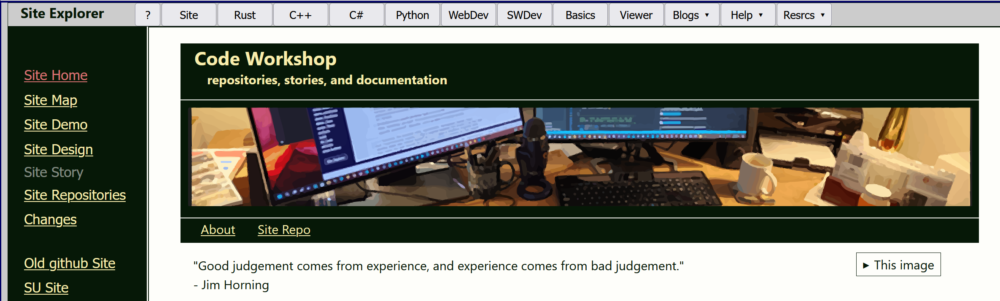

# NewSite
Replaces original site designed for me to learn Rust by trying to explain it.
The original site grew to document languages: Rust, C++, C#, Python, and 
Static web technologies, with code and discussions.

The original site became complex to use and maintain.
NewSite is intended to make usability and maintenance improvements.

# Status
Site, Rust, C++, Python, and Basic tracks have most of the original site's content
WebDev, and SWDev tracks and Viewer are early stage with lots of missing content.