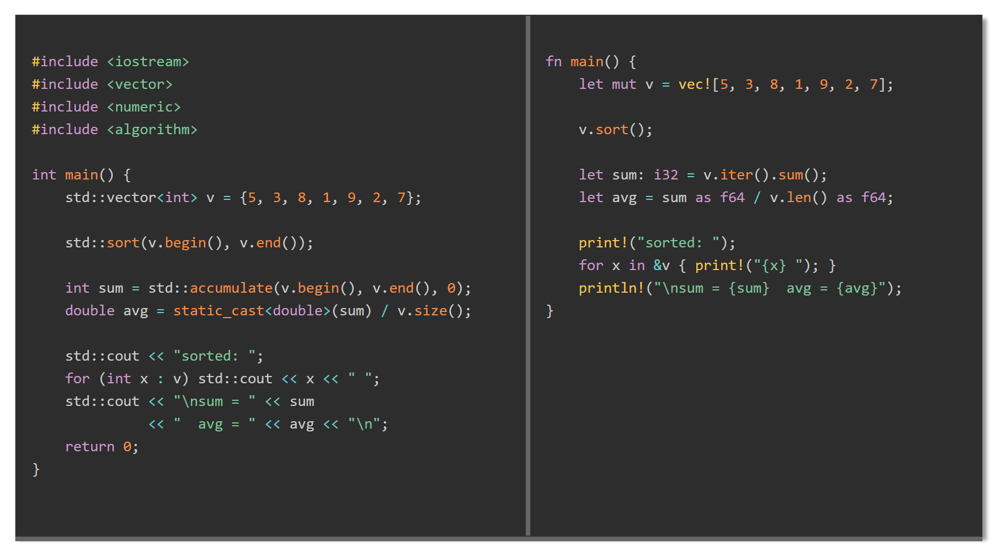

# ViewSplitterBarComponent

A W3C custom element (`<view-splitter-bar>`) that displays two adjacent panels separated by a draggable vertical splitter bar and a draggable horizontal resizer along the bottom edge. Dragging the splitter redistributes width between panels without changing total component width. Dragging the resizer changes the height of both panels together. Clicking either panel shifts the split by one step.

## Files

```
ViewSplitterBarComponent/
  js/ViewSplitterBar.js          component definition
  css/ViewSplitterBar.css        host-page placement helpers
  ViewSplitterBarComponent.html  demo / test page
  SpecSplitterBarComponent.md    design specification
```

## Setup

Load the component script (and optionally Prism for syntax highlighting):

```html
<link rel="stylesheet" href="../css/prism.css">
<link rel="stylesheet" href="css/ViewSplitterBar.css">
<script src="../js/prism.js" defer></script>
<script src="js/ViewSplitterBar.js" defer></script>
```

The containing page should define `--light` and `--dark` CSS custom properties:

```css
:root {
  --light: #f0f0f0;
  --dark:  #333;
}
```

## Usage



### Plain text

```html
<view-splitter-bar width="60rem" height="16rem" left-ratio="0.5">
  <pre slot="left">Left panel content.</pre>
  <pre slot="right">Right panel content.</pre>
</view-splitter-bar>
```

### Prism syntax highlighting

Supply a `<pre><code class="language-...">` in each named slot:

```html
<view-splitter-bar width="70rem" height="20rem" highlight="prism">
  <pre slot="left"><code class="language-cpp">
int main() { return 0; }
  </code></pre>
  <pre slot="right"><code class="language-rust">
fn main() {}
  </code></pre>
</view-splitter-bar>
```

## Attributes

| Attribute       | Default        | Description                                                     |
|-----------------|----------------|-----------------------------------------------------------------|
| `width`         | `auto`         | Total component width (px or rem)                               |
| `height`        | `auto`         | Initial panel height (px or rem); draggable after render        |
| `left-ratio`    | `0.5`          | Initial fraction of total width given to the left panel         |
| `bar-width`     | `6px`          | Width of the vertical splitter and height of the bottom resizer |
| `bar-color`     | `#888`         | Color of both the splitter and the resizer                      |
| `bg-color`      | `var(--light)` | Background of both panels                                       |
| `color`         | `var(--dark)`  | Text color of both panels                                       |
| `overflow-x`    | `auto`         | Horizontal overflow: `auto`, `scroll`, or `hidden`              |
| `code-padding`  | `0.75rem 1rem` | Padding inside each panel                                       |
| `highlight`     | (none)         | Set to `prism` to enable Prism.js syntax highlighting           |
| `step-px`       | `40`           | Pixels transferred per panel click                              |
| `min-panel-px`  | `120`          | Minimum width in pixels for either panel                        |
| `min-height-px` | `80`           | Minimum container height in pixels when dragging the resizer    |

## Interaction

- **Drag splitter** — redistributes width between panels; total width stays fixed.
- **Drag resizer** — changes height of both panels; width is unaffected.
- **Click left panel** — transfers `step-px` pixels from right to left.
- **Click right panel** — transfers `step-px` pixels from left to right.

## Inline Style Notes

- `font-size` cascades through the shadow DOM boundary; set it on the element directly.
- `height` is managed as an explicit pixel value on the inner container. Use the `height` attribute to set an initial value; after the first resizer drag the attribute is no longer consulted.
